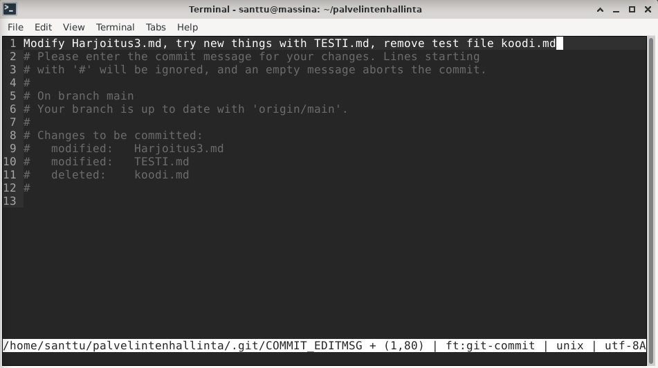

# Harjoitus 3 - Versionhallinta

## z) Lue ja tiivistä artikkeli muutamalla ranskalaisella viivalla. Tässä z-alakohdassa ei tarvitse siis tehdä testejä tietokoneella.

### [Commonmark contributors: Markdown Reference](https://commonmark.org/help/) (huomaa ainakin otsikot risuaidoilla, kappalejako tyhjällä rivillä, sisennys (tab) koodia, lista, linkki, kuva.)

- Markdown on yksinkertainen työkalu tekstin muokkaamiseen
- Tekstiä voi muokata \*-merkeillä. \**kursivoi\** ja \*\***lihavoi***\*
- "#" tekstin edessä tekee siitä otsikon. Risuaitojen määrä kertoo otsikon tason (# - pääotsikko, ## - alaotsikko jne.)
- Tyhjä rivi muodostaa tekstiin kappalejaon
- Painamalla kerran tab-näppäintä saa tehtyä tekstiin sisennyksen. Sisennyksessä oleva teksti näytetään erillisenä "koodilohkona"
```    
	santtu@massina:~/palvelintenhallinta$ ls -la
	total 44
	drwxr-xr-x  3 santtu santtu  4096 18. 4. 11:53 .
	drwxr-xr-x 18 santtu santtu  4096 18. 4. 11:48 ..
	drwxr-xr-x  8 santtu santtu  4096 18. 4. 11:58 .git
	-rw-r--r--  1 santtu santtu   740 18. 4. 12:06 Harjoitus3.md
	-rw-r--r--  1 santtu santtu 18092 18. 4. 11:48 LICENSE
	-rw-r--r--  1 santtu santtu    39 18. 4. 11:48 README.md
	-rw-r--r--  1 santtu santtu   166 18. 4. 11:48 TESTI.md
```
- Tavallisen listan voi muodostaa laittamalla tekstin eteen merkin `* tai -` 
- Numeroidun listan voi muodostaa laittamalla tekstin eteen `1. tai 1)`
- Linkki muodostuu seuraavasti: `[Linkin nimi](url-osoite)`
- Kuvan saa lisättyä melkein samalla tavalla: ``


## a) MarkDown. Tee tämän tehtävän raportti MarkDownina. Helpointa on tehdä raportti GitHub-varastoon, jolloin md-päätteiset tiedostot muotoillaan automaattisesti. Tyhjä rivi tekee kappalejaon, risuaita ‘#’ tekee otsikon, sisennys merkitsee koodinpätkän.

Tämän tehtävän raportti löytyy GitHubista: [Palvelinten hallinta -  Harjoitus 3](https://github.com/santtuhurri/palvelintenhallinta/blob/main/Harjoitus3.md)

## b) Pull first. Tee useita muutoksia git-varastoosi. Tee muutama muutos, jossa yksi commit koskee useampaa tiedostoa. Anna hyvä kuvaukset (commit message), yksi englanninkielinen lause imperatiivissa (määräysmuodossa) "Add top level menu to Foobar synchronizer"

Aloitin muutosten tekemisen poistamalla koodi.md nimisen tiedoston, jota käytin apuna "koodilohkon" luomisessa.



## b) Kaikki kirjataan. Näytä omalla git-varastollasi esimerkit komennoista ‘git log’, ‘git diff’ ja ‘git blame’. Selitä tulokset.

## c) Huppis! Tee tyhmä muutos gittiin, älä tee commit:tia. Tuhoa huonot muutokset ‘git reset --hard’. Huomaa, että tässä toiminnossa ei ole peruutusnappia.

## d) Formula. Tee uusi salt-tila (formula, moduli, infraa koodina). (Eli uusi tiedosto esim. /srv/salt/terontila/init.sls). Voit tehdä ihan yksinkertaisen parin funktion (pkg, file...) tilan, tai edistyneemmin asentaa ja konfiguroida minkä vain uuden ohjelman: demonin, työpöytäohjelman tai komentokehotteesta toimivan ohjelman. Käytä tarvittaessa ‘find -printf “%T+ %p\n”|sort’ löytääksesi uudet asetustiedostot.

