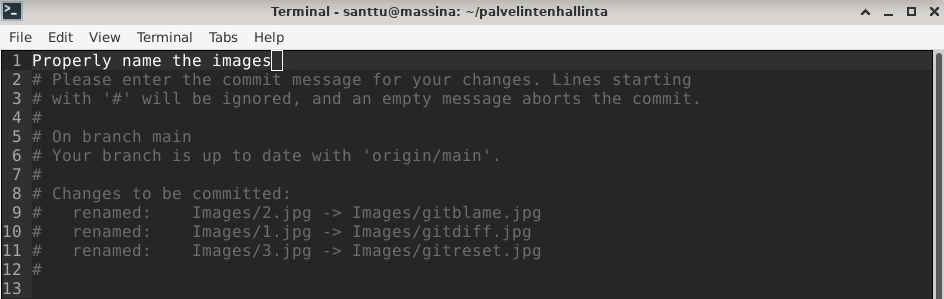

# Palvelinten hallinta - Harjoitus 3

Tämän tehtävän harjoitukset on tehty samalla kokoonpanolla kuin aiemmissakin [harjoituksissa.](https://hurrisanttu.wordpress.com/) (Update 21.4. tehtävän tekstiä muokattu ja lisätty oikea kuva. Tehtäviin lisätty käytettyjä komentoja, jotka unohtuneet alkuperäisestä tekstistä.)
##

## z) Lue ja tiivistä artikkeli muutamalla ranskalaisella viivalla. Tässä z-alakohdassa ei tarvitse siis tehdä testejä tietokoneella.

### [Commonmark contributors: Markdown Reference](https://commonmark.org/help/) (huomaa ainakin otsikot risuaidoilla, kappalejako tyhjällä rivillä, sisennys (tab) koodia, lista, linkki, kuva.)

- Markdown on yksinkertainen työkalu tekstin muokkaamiseen
- Tekstiä voi muokata \*-merkeillä. \**kursivoi\** ja \*\***lihavoi***\*
- "#" tekstin edessä tekee siitä otsikon. Risuaitojen määrä kertoo otsikon tason (# - pääotsikko, ## - alaotsikko jne.)
- Tyhjä rivi muodostaa tekstiin kappalejaon
- Painamalla kerran tab-näppäintä saa tehtyä tekstiin sisennyksen. Sisennyksessä oleva teksti näytetään erillisenä "koodilohkona"
```    
	santtu@massina:~/palvelintenhallinta$ ls -la
	total 44
	drwxr-xr-x  3 santtu santtu  4096 18. 4. 11:53 .
	drwxr-xr-x 18 santtu santtu  4096 18. 4. 11:48 ..
	drwxr-xr-x  8 santtu santtu  4096 18. 4. 11:58 .git
	-rw-r--r--  1 santtu santtu   740 18. 4. 12:06 Harjoitus3.md
	-rw-r--r--  1 santtu santtu 18092 18. 4. 11:48 LICENSE
	-rw-r--r--  1 santtu santtu    39 18. 4. 11:48 README.md
	-rw-r--r--  1 santtu santtu   166 18. 4. 11:48 TESTI.md
```
- Tavallisen listan voi muodostaa laittamalla tekstin eteen merkin `* tai -` 
- Numeroidun listan voi muodostaa laittamalla tekstin eteen `1. tai 1)`
- Linkin saa luotua seuraavasti: `[Linkin nimi](url-osoite)`
- Kuvan saa lisättyä seuraavasti: ``
##

## a) MarkDown. Tee tämän tehtävän raportti MarkDownina. Helpointa on tehdä raportti GitHub-varastoon, jolloin md-päätteiset tiedostot muotoillaan automaattisesti. Tyhjä rivi tekee kappalejaon, risuaita ‘#’ tekee otsikon, sisennys merkitsee koodinpätkän.

Tämän tehtävän raportti löytyy GitHubista: [Palvelinten hallinta - Harjoitus 3](https://github.com/santtuhurri/palvelintenhallinta/blob/main/Harjoitus3.md)
##

## b) Pull first. Tee useita muutoksia git-varastoosi. Tee muutama muutos, jossa yksi commit koskee useampaa tiedostoa. Anna hyvä kuvaukset (commit message), yksi englanninkielinen lause imperatiivissa (määräysmuodossa) "Add top level menu to Foobar synchronizer"

Aluksi käytin komentoa `git pull`, joka "vetää" uusimman version GitHubista.
Aloitin muutosten tekemisen poistamalla koodi.md nimisen tiedoston `rm koodi.md` , jota käytin apuna "koodilohkon" luomisessa, eikä se enää tässä vaiheessa ollut tarpeellinen.
Seuraavaksi muokkasin TESTI.md tiedostoa, jonka avulla kokeilin vielä aiemmin opittuja Markdownin ominaisuuksia, kuten fontin muokkaamista sekä numeroidun listan tekemistä.
Lopuksi kirjoitin vielä päivityksiä Harjoitus3.md tiedostoon ja aloitin kirjoittamaan tätä osiota. Viimeisenä päivitin tekemäni muutokset GitHubiin komennoilla `git add .`, `git commit` ja `git push`. Kävin vielä verkkosivulla tarkistamassa, että muutokset olivat päivittyneet. (Update 21.4. päivitin käytetyt komennot alussa, sekä lopussa.)

Tähän kohtaan halusin myös lisätä kuvan `git commit` kohdasta ja kohtasin lieviä vaikeuksia kuvan lisäämisessä. Apua hain [Stack Overflowsta](https://stackoverflow.com/questions/41604263/how-do-i-display-local-image-in-markdown) ja vaikka kaikki näytti olevan niin kuin pitää, ei kuva silti näkynyt GitHubissa.
Lopulta tajusin, että yritin lisätä kuvaa, joka sijaitsi vain ja ainoastaan Windows-pöytäkoneellani.
Siirsin siis kuvan henkilökohtaisen pilven kautta Linux-virtuaalikoneelleni, loin GitHub arkistoni alle uuden "Images" nimisen kansion johon lisäsin kuvan ja sain sen onnistuneesti näkyviin.


Annoin myös käyttämilleni screenshoteille fiksummat nimet. Kuvien nimet on muokattu suoraan virtuaalikoneen Images-kansiossa. (Update 21.4. päivitin tekstiä ja vahdoin kuvan.)


##

## b) Kaikki kirjataan. Näytä omalla git-varastollasi esimerkit komennoista ‘git log’, ‘git diff’ ja ‘git blame’. Selitä tulokset.

`git log` näyttää kaikki tehdyt muutokset, jotka on viety loppuun `git commit` komennolla. Ylhäällä lukee muutoksen commit-tunniste, tämän alapuolella muutoksen tekijän nimi sekä sähköposti.
Sen jälkeen ilmoitetaan muutoksen ajankohta ja viimeisenä lukee vielä 'commit message' eli muutoksen tekijän viesti, siitä mitä muutos pitää sisällään.
Tästä lokitiedostosta käy hyvin ilmi ongelmat kuvan lisäämisen kanssa.


`git diff` näyttää kaikki eroavaisuudet versioiden välillä, kunnes käytetään komentoa `git add .`.
Aluksi ilmoitetaan mistä tiedostosta on kyse ja '@@'-merkkien välissä olevat numerot kertovat mistä rivistä alkaen ja kuinka monta riviä muutos sisältää.
Valkoinen teksti ei ole muuttunut, punainen teksti ja '-' -merkki kertovat poistetuista kohdista ja vihreä teksti sekä '+' -merkki kertovat lisätyistä kohdista.


`git blame` toimii vain yksittäisen tiedoston kohdalla, esim. `git blame TESTI.md`.
Se kertoo yksityiskohtaisesti tiedostoon tehdyt muutokset. Numero-kirjainyhdistelmä on muutoksen id, sitä seuraa muutoksen tekijän nimi sekä muutoksen ajankohta.
Seuraavana näkyy rivinumero ja viimeisenä itse rivin sisältö. Tämän avulla on helppo tarkistaa kuka on tehnyt tiedostoon muutoksia ja milloin.


##

## c) Huppis! Tee tyhmä muutos gittiin, älä tee commit:tia. Tuhoa huonot muutokset ‘git reset --hard’. Huomaa, että tässä toiminnossa ei ole peruutusnappia.

Tätä kohtaa varten kirjoitin tähän harjoitukseen tekstin "HUPS! Tein tähän tyhmän muutoksen, jota en halua viedä loppuun."
Tallensin tiedoston normaalisti, käytin komentoa `git add .` sekä `git status`, joka näytti, että Harjoitus3.md odottaa committia.
Lopuksi ajoin komennon `git reset --hard`. Ja sain ilmoituksen "HEAD is now at 5267f2d Add minor change".
Ajettu komento oli siis poistanut tekemäni muutoksen ja palauttanut vanhemman version, jolle oli tehty commit. (Update 21.4. päivitin tekstiin komennot ja oikean kuvan.)


##

## d) Formula. Tee uusi salt-tila (formula, moduli, infraa koodina). (Eli uusi tiedosto esim. /srv/salt/terontila/init.sls). Voit tehdä ihan yksinkertaisen parin funktion (pkg, file...) tilan, tai edistyneemmin asentaa ja konfiguroida minkä vain uuden ohjelman: demonin, työpöytäohjelman tai komentokehotteesta toimivan ohjelman. Käytä tarvittaessa ‘find -printf “%T+ %p\n”|sort’ löytääksesi uudet asetustiedostot.

Aloitin asentamalla pelin bastet komennoilla `sudo apt-get update` ja `sudo apt-get install bastet`.
Asennuksen jälkeen kokeilin pelin toimivaksi komennolla `bastet` ja tarkistin myös sen sijainnin komennolla `whereis bastet`, tuloksesi sain "bastet: /usr/games/bastet".
Tämän jälkeen poistin pelin komennolla `sudo apt-get purge bastet`.

Seuraavaksi siirryin kotihakemistooni ja loin sinne tiedostot `kilpailun_saannot.txt` ja `tulokset.txt`. Tarkoituksena oli siis asentaa orja-koneille peli nimeltä Bastet, luoda pelin kansioon kyseiset tiedostot, jotka kertovat kyseessä olevan leikkimielinen kilpailu palkintoineen, selostavat säännöt sekä mahdollistavat tulosten kirjaamisen.

Näiden luomisen jälkeen siirryin kansioon `/srv/salt` ja loin uuden kansion `sudo mkdir bastet` ja sinne tiedoston `sudoedit init.sls`. Tiedostoon lisäsin seuraavat tekstit:
```
	bastet:
	  pkg.installed
	
	/usr/games/kilpailun_saannot.txt:
	  file.managed:
	    - source: /home/santtu/kilpailun_saannot.txt
	
	/usr/games/tulokset.txt:
	  file.managed:
	    - source: /home/santtu/tulokset.txt
```
Tämän jälkeen oli aika kokeilla salt-tilaa komennolla `sudo salt '*' state.apply bastet`. Tulokseksi sain "Succeeded: 3(changed=3)", ajoin komennon uudestaan ja nyt tulos oli "Succeeded: 3". Tavoitetila oli siis saavutettu ja oli aika tarkistaa toimiiko peli sekä löytyvätkö tiedostot.


Käynnistin pelin komennolla `bastet` ja pääsin pelaamaan. Siirryin kansioon `/usr/games` ja löysin aiemmin luomani tiedostot `kilpailun_saannot.txt` sekä `tulokset.txt`.
Salt-tila toimi siis halutulla tavalla, mutta ongelmaksi muodostui `tulokset.txt` tiedoston muokkaaminen ilman oikeuksia.
Muokkasin vielä  `init.sls` tiedostoa seuraavasti:
```
	/usr/games/tulokset.txt:
	  file.managed:
	    - source: /home/santtu/tulokset.txt
	    - mode: 777
```
Nyt kaikilla käyttäjillä on oikeudet muokata tiedostoa ja testasin tätä ajamalla tilan uudestaan sekä onnistuneesti muokkaamalla tiedostoa.

Kokeilin myös tulosten hakemista herra-koneelta komennolla `sudo salt '*' cmd.run 'cat /usr/games/tulokset.txt'`. Vastauksesi sain muokatun tiedoston, eli  muokattu salt-tila toimi täysin halutulla tavalla.
##

## Lähteet

Atlassian.com. Git Status: Inspecting a repository. [https://www.atlassian.com/git/tutorials/inspecting-a-repository](https://www.atlassian.com/git/tutorials/inspecting-a-repository)

GitHub.com. can file.directory recurse chmod? (updated) #3471. [https://github.com/saltstack/salt/issues/3471](https://github.com/saltstack/salt/issues/3471)

Karvinen, Tero. Oppitunnit 2022-04-14, Configuration management systems 2022. [https://terokarvinen.com/2021/configuration-management-systems-2022-spring/](https://terokarvinen.com/2021/configuration-management-systems-2022-spring/)
